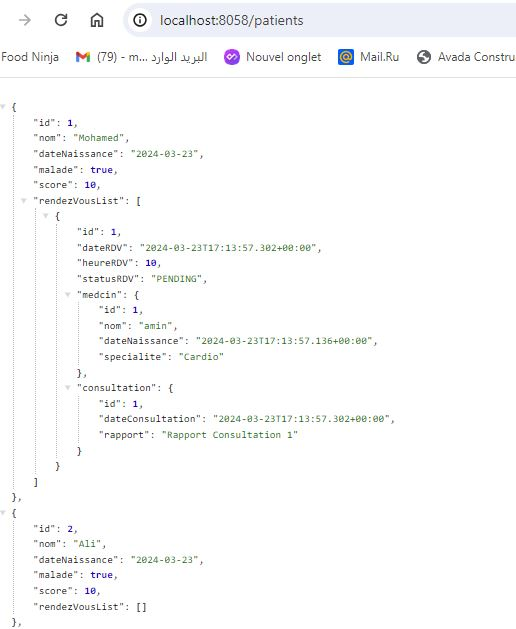

<h2>Activité Pratique ORM et Hibernate</h2>

 Créer un projet Spring Initializer avec les dépendances JPA, H2, Spring Web et Lombock
3. Créer l'entité JPA Patient ayant les attributs :
       - id de type Long
       - nom de type String
       - dateNaissanec de type Date
       - malade de type boolean
       - score de type int
4. Configurer l'unité de persistance dans le ficher application.properties 
5. Créer l'interface JPA Repository basée sur Spring data
6. Tester quelques opérations de gestion de patients :
    - Ajouter des patients
    - Consulter tous les patients
    - Consulter un patient
    - Chercher des patients
    - Mettre à jour un patient 
    - supprimer un patient
7. Migrer de H2 Database vers MySQL

<h1>Api List Patients</h1>

<h1>Api List Users</h1>

